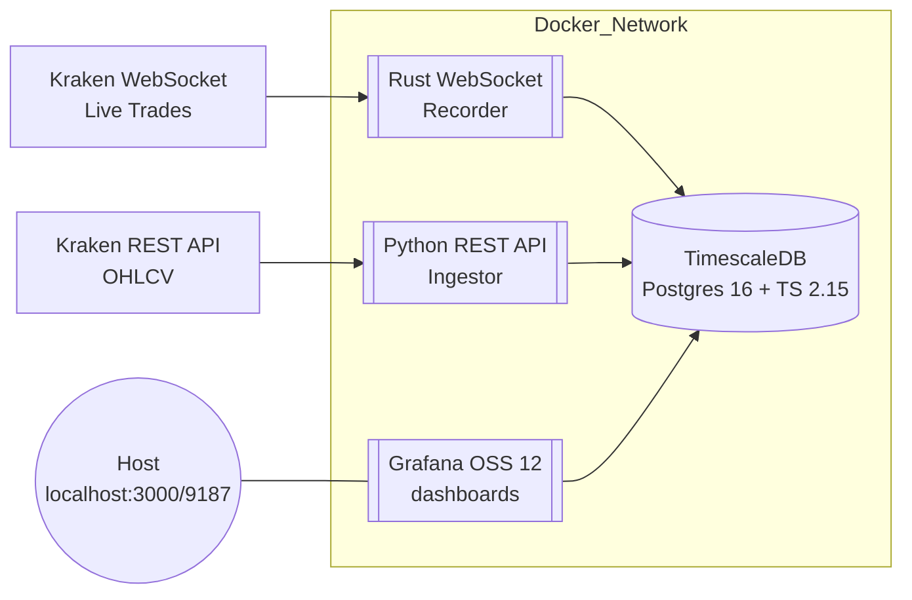

# AlphaDB 📈

A self-hosted **TimescaleDB + Grafana** stack for real-time cryptocurrency market data analysis and visualization.


## 🚀 Quick Start

1. **Clone and setup**
   ```bash
   git clone <your-repo-url>
   cd alphadb
   cp .env.example .env
   # Edit .env with your preferred passwords
   ```

2. **Launch the stack**
   ```bash
   docker compose up -d
   ```

3. **Initialize database**
   ```bash
   docker exec -i tsdb psql -U trader -d market < init.sql
   ```

4. **Install Python dependencies**
   ```bash
   pip install -r requirements.txt
   ```

5. **Backfill historical data** (choose one method):

   **Option A: CoinGecko Pro API (Recommended for 90 days)**
   ```bash
   export COINGECKO_API_KEY=your_api_key_here
   ./scripts/run_coingecko_backfill.sh
   ```
   
   **Option B: Kraken API (Limited to ~19 hours)**
   ```bash
   ./scripts/run_backfill.sh
   ```

6. **Verify deployment**:
   ```bash
   # Check all services are running
   docker compose ps
   
   # Verify WebSocket is collecting data
   curl -s http://localhost:9187/metrics | grep trades_processed_total
   
   # Check database has data
   docker exec tsdb psql -U trader -d market -c "SELECT COUNT(*) FROM trades;"
   ```

7. **Access services**:
   - **Grafana**: http://localhost:3000 (admin/[your password])
   - **WebSocket Metrics**: http://localhost:9187/metrics

## 📊 Features

- **Rust WebSocket recorder** - Live tick-by-tick trade feeds from Kraken
- **REST API ingestion** - OHLCV bars for BTC/USDT and ETH/USDT via Python scripts
- **Historical backfill** - 90 days of data via CoinGecko Pro API
- **TimescaleDB hypertables** - Time-series storage with automatic partitioning
- **Continuous aggregates** - Real-time 5-minute OHLCV views
- **Grafana dashboards** - Bitcoin, Ethereum, features monitoring, and WebSocket performance
- **Tick-level analysis** - Candlestick charts built from live trade data
- **System monitoring** - WebSocket latency, throughput, database health, and SLA tracking
- **Prometheus metrics** - Built-in metrics endpoint for observability
- **Persistent storage** - Named Docker volumes for data retention
- **Pre-configured setup** - Grafana dashboards and datasources included

## 🏗️ Architecture



## 📁 Project Structure

```
alphadb/
├── README.md                    # This file
├── docker-compose.yml           # Docker services configuration
├── init.sql                     # Database schema initialization
├── .env.example                 # Environment variables template
├── requirements.txt             # Python dependencies
├── gateway/                     # Rust WebSocket recorder
│   ├── Cargo.toml              # Rust dependencies
│   ├── Dockerfile              # WebSocket recorder container
│   ├── config/
│   │   └── config.toml         # WebSocket recorder configuration
│   └── src/                    # Rust source code
│       ├── main.rs             # Main application entry
│       ├── ws_client.rs        # WebSocket client implementation
│       ├── buffer.rs           # Trade batching system
│       └── db_sink.rs          # Database writer
├── scripts/
│   ├── ingest.py               # REST API data ingestion
│   ├── backfill.py             # Historical data backfill
│   └── export_features.py      # Feature engineering exports
├── grafana/
│   ├── dashboards/             # Grafana dashboard definitions
│   │   ├── btc-dashboard.json
│   │   ├── eth-dashboard.json
│   │   ├── websocket-performance-dashboard.json
│   │   └── features-monitoring-dashboard.json
│   └── datasources/            # Grafana datasource configuration
│       └── ds.yml
├── sql/                        # SQL feature engineering
│   └── features_*.sql          # Feature computation queries
└── docs/
    ├── SETUP.md                # Detailed setup instructions
    ├── API.md                  # Database schema and API docs
    └── TROUBLESHOOTING.md      # Common issues and solutions
```

## 🛠️ Requirements

- **Docker** & **Docker Compose**
- **Rust 1.70+** (for WebSocket recorder development)
- **Python 3.8+** (for data ingestion and feature engineering)
- **8GB RAM** recommended
- **10GB disk space** minimum

## 📈 Dashboard Features

- **Candlestick Chart**: OHLCV visualization from live trade data
- **Price Monitoring**: Real-time BTC/ETH price tracking  
- **Volume Analysis**: Trading volume with cryptocurrency units
- **WebSocket Performance**: Latency, throughput, and connection health monitoring
- **Feature Engineering**: Feature computation and monitoring
- **Data Health**: Collection statistics and freshness monitoring
- **Time Ranges**: From seconds to days of historical data

## 🔧 Configuration

### Environment Variables

Copy `.env.example` to `.env` and customize:

```bash
# Database Configuration
POSTGRES_USER=trader
POSTGRES_PASSWORD=your_secure_password_here
POSTGRES_DB=market

# Grafana Configuration  
GF_SECURITY_ADMIN_PASSWORD=your_grafana_admin_password_here
```

### Database Schema

- **`trades`**: Individual trade records from WebSocket feed
- **`ohlcv_1m`**: 1-minute OHLCV hypertable
- **`ohlcv_5m`**: 5-minute continuous aggregate
- **Automatic partitioning** by time (1-day chunks)

## 🛠️ CLI Commands

```bash
# Start/stop all services
docker compose up -d
docker compose down

# View logs
docker compose logs -f ws_recorder    # WebSocket recorder logs
docker compose logs -f ingestor       # Python ingestor logs
docker compose logs -f grafana        # Grafana logs

# Database access
docker exec -it tsdb psql -U trader -d market

# Check WebSocket performance
SELECT COUNT(*) FROM trades WHERE ts_exchange >= NOW() - INTERVAL '1 hour';

# Verify continuous aggregates
SELECT * FROM ohlcv_btc_usdt_5m ORDER BY bucket DESC LIMIT 3;

# Monitor WebSocket metrics
curl http://localhost:9187/metrics

# Restart specific service
docker compose restart ws_recorder

# Build Rust recorder locally
cd gateway && cargo build --release

# Run feature engineering
python scripts/export_features.py
```

## 📚 Documentation

- [Setup Guide](docs/SETUP.md) - Detailed installation and configuration
- [API Documentation](docs/API.md) - Database schema and query examples  
- [Troubleshooting](docs/TROUBLESHOOTING.md) - Common issues and solutions

## 🤝 Contributing

We welcome contributions! Please see [CONTRIBUTING.md](CONTRIBUTING.md) for details.

## 📄 License

This project is licensed under the MIT License - see the [LICENSE](LICENSE) file for details.

## ⚠️ Disclaimer

This software is for educational and research purposes only. Not financial advice. Trade at your own risk.

## 🙏 Acknowledgments

- [TimescaleDB](https://www.timescale.com/) for excellent time-series database
- [Grafana](https://grafana.com/) for powerful visualization platform
- [CCXT](https://github.com/ccxt/ccxt) for cryptocurrency exchange integration