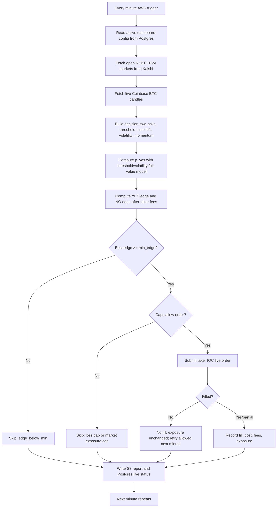

# Fair-Value Live Strategy

## Heartbeat Snapshot

Latest checked run: `fv_live_20260604T184914Z`.

- AWS rule: `alphadb-fair-value-live` is `ENABLED` at `rate(1 minute)`.
- Live orders: enabled through `--submit-live-orders`, `ALPHADB_ENABLE_LIVE_ORDERS=1`, and `ALPHADB_HUMAN_CUTOVER_APPROVED=1`.
- Latest order attempt: submitted 17 NO contracts on `KXBTC15M-26JUN041500-00`, but fill count was 0.
- Current live P&L: `-$13.1152`.
- Current settlement: reconciled, with `$0` unsettled exposure.

## Strategy In One Sentence

Every minute, price the current BTC 15-minute Kalshi market from live Coinbase BTC movement, compare that fair value to executable Kalshi YES/NO asks after taker fees, and submit a small IOC order only when the best side has positive edge.

## Fair-Value Formula

The live MVP uses `kxbtc15m.threshold_volatility_fair_value.v1`.

Inputs:

- `price`: latest observable Coinbase BTC close at or before decision time.
- `threshold`: Kalshi market payout threshold/strike.
- `time_to_close`: seconds until market close, clamped from 1 second to 15 minutes.
- `volatility`: recent Coinbase realized volatility, floored at `0.0005`.
- `momentum`: recent Coinbase BTC momentum.

Formula:

```text
expected_price = price + price * momentum * 0.25
horizon_scale = sqrt(time_to_close_seconds / 60)
sigma_dollars = max(price * volatility * horizon_scale, 0.01)
z = (expected_price - threshold) / sigma_dollars
p_yes = normal_cdf(z)
```

Interpretation:

- If BTC is above the threshold, or momentum pushes expected BTC above it, `p_yes` rises.
- If BTC is below the threshold, `p_yes` falls.
- If volatility/time remaining is high, the model is less certain because the threshold is easier to cross.

## Trade Selection

For each decision row:

```text
yes_edge = p_yes - yes_ask - taker_fee(yes_ask)
no_edge = (1 - p_yes) - no_ask - taker_fee(no_ask)
```

The strategy picks whichever side has larger edge. If the best edge is below
`min_edge`, it skips. In AWS live operation, `min_edge` comes from the active
dashboard-owned Postgres runtime config.

Order sizing is configured by the dashboard-owned runtime config and recorded in
each run manifest with config id, version, and full non-secret snapshot. The
seeded canary defaults are:

- Max order dollars: `$5`.
- Max exposure per market: `$5`.
- Max daily loss/exposure: `$50`.
- Min edge: `0.0`.
- Max markets: `20`.
- Execution style: taker-only IOC.
- No-fill attempts do not consume per-market exposure.
- Filled/partially filled attempts consume per-market exposure.

Change the non-secret values in the dashboard and click `Save`. The next AWS
run reads the latest active Postgres config. Secrets and infrastructure wiring
remain in AWS/Secrets Manager.

## Flow



## What Replay Means Here

Fair-value replay re-runs this same decision policy over saved decision rows and settlement labels. It answers: if we had applied this simple fair-value policy to those rows, what would we have traded, skipped, paid in fees, and earned or lost after settlement?

That is different from event-driven replay. This MVP replay does not reconstruct every raw market event. It is a fast policy-replay loop for strategy iteration.
