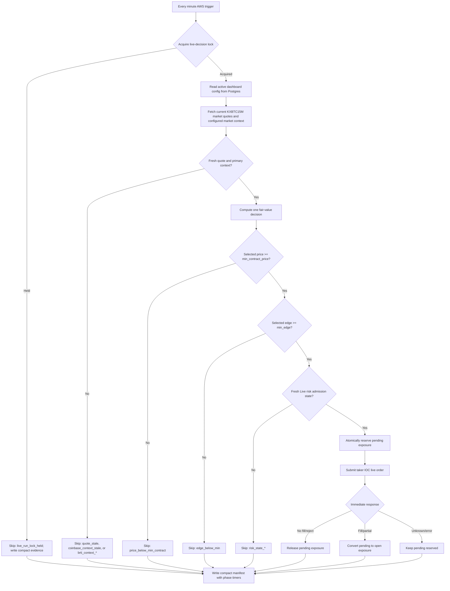

# Fair-Value Live Strategy

## Heartbeat Snapshot

Latest checked live runtime state: paused after the overlapping-worker incident.

- AWS rule: `alphadb-fair-value-live` must remain `DISABLED` until the
  one-cycle smoke gate passes.
- Deployed live config must preserve `min_contract_price=0.25` and
  `min_edge=0`.
- Prior P&L evidence is runtime-contaminated by overlapping five-minute workers
  on a one-minute schedule.
- Current runtime target: one scheduled invocation makes one bounded current
  decision, writes compact evidence, and exits in under 45 seconds at p95.

## Strategy In One Sentence

Every minute, price the current BTC 15-minute Kalshi market from the configured market context source, compare that fair value to executable Kalshi YES/NO asks after taker fees, and submit a small IOC order only when the best side has positive edge.

## Market Context Source

The dashboard-owned runtime config now carries `market_context_source`:

- `coinbase_primary`: Coinbase BTC features supply the model external BTC price and freshness gate.
- `brti_primary`: fresh BRTI latest context supplies `external_close`; missing, stale, invalid, wrong-index, or future-timestamp BRTI context skips cleanly with no implicit Coinbase fallback.
- `fixture`: fixture-backed context for local smoke runs.

Phase 1 BRTI mode intentionally keeps Coinbase diagnostic-only. When Coinbase is available, manifests can report Coinbase freshness and BRTI-vs-Coinbase basis; when Coinbase is unavailable, a fresh BRTI decision can still score. The BRTI Phase 1 model path uses the BRTI current value for `external_close`, zero momentum, and the configured volatility floor.

## Fair-Value Formula

The live MVP uses `kxbtc15m.threshold_volatility_fair_value.v1`.

Inputs:

- `price`: current BTC value from the configured market context source.
- `threshold`: Kalshi market payout threshold/strike.
- `time_to_close`: seconds until market close, clamped from 1 second to 15 minutes.
- `volatility`: recent source volatility when available, floored at `0.0005`; BRTI Phase 1 uses the floor.
- `momentum`: recent source momentum when available; BRTI Phase 1 uses zero momentum.

Formula:

```text
expected_price = price + price * momentum * 0.25
horizon_scale = sqrt(time_to_close_seconds / 60)
sigma_dollars = max(price * volatility * horizon_scale, 0.01)
z = (expected_price - threshold) / sigma_dollars
p_yes = normal_cdf(z)
```

Interpretation:

- If BTC is above the threshold, or momentum pushes expected BTC above it, `p_yes` rises.
- If BTC is below the threshold, `p_yes` falls.
- If volatility/time remaining is high, the model is less certain because the threshold is easier to cross.

## Trade Selection

For each decision row:

```text
yes_edge = p_yes - yes_ask - taker_fee(yes_ask)
no_edge = (1 - p_yes) - no_ask - taker_fee(no_ask)
```

The strategy picks the side with the larger edge. If the selected contract price
is below `min_contract_price`, it skips with `price_below_min_contract`; if the
selected edge is below `min_edge`, it skips with `edge_below_min`. In AWS live
operation, both values come from the active dashboard-owned Postgres runtime
config.

Order sizing is configured by the dashboard-owned runtime config and admitted by
compact Live risk admission state in Operational State. Each run manifest
records config id, version, full non-secret snapshot, market context evidence, quote freshness, risk
admission result, and phase timings. The seeded canary defaults are:

- Max order dollars: `$5`.
- Max exposure per market: `$5`.
- Max daily loss/exposure: `$50`.
- Min edge: `0.0`.
- Min contract price: `$0.25`.
- Max markets: `20`.
- Market context source: `coinbase_primary` by default; switch to `brti_primary`
  only after the live BRTI collector is producing fresh latest context.
- Execution style: taker-only IOC.
- No-fill attempts release pending exposure.
- Filled/partially filled attempts convert pending exposure into open exposure.
- Unknown exchange responses keep pending exposure reserved until reconciliation
  refreshes state.

Change the non-secret values in the dashboard and click `Save`. The next AWS
run reads the latest active Postgres config. Secrets and infrastructure wiring
remain in AWS/Secrets Manager.

## Flow



## What Replay Means Here

Fair-value replay re-runs this same decision policy over saved decision rows and settlement labels. It answers: if we had applied this simple fair-value policy to those rows, what would we have traded, skipped, paid in fees, and earned or lost after settlement?

That is different from event-driven replay. This MVP replay does not reconstruct every raw market event. It is a fast policy-replay loop for strategy iteration.
