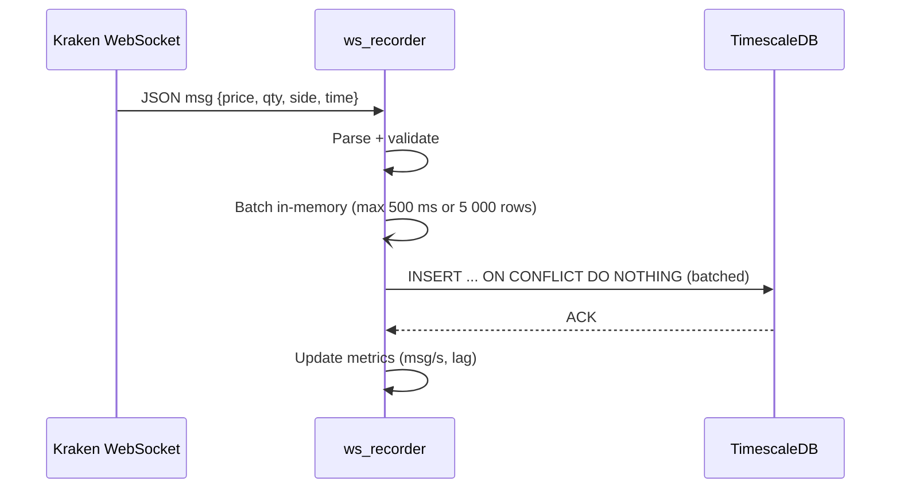

## **Detailed Engineering Requirements – `gateway/ws_recorder.rs`**

*A Rust-powered, always-on WebSocket recorder that captures every trade tick from a chosen exchange and writes it, loss-lessly, into the `trades` hypertable in TimescaleDB.*

---

### 1 ️⃣ **Purpose & Scope**

| Item                       | Detail                                                                                                     |
| -------------------------- | ---------------------------------------------------------------------------------------------------------- |
| **Primary goal**           | Persist *all* tick-level trades (price, size, side, venue timestamp) with sub-second latency.              |
| **Exchanges**              | v1: Kraken (pairs: `BTC/USDT`, `ETH/USDT`). v2 should accept any CCXT-supported venue given a config file. |
| **Storage target**         | TimescaleDB in container `tsdb` (network alias).                                                           |
| **Language**               | Rust 2021, single crate `ws_recorder`.                                                                     |
| **Runtime**                | Tokio 1.37 async, compiled with `-C target-cpu=native -C lto=thin`.                                        |
| **Throughput requirement** | Sustain ≥ 5 000 msgs/sec (burst) without message loss.                                                     |
| **Latency SLA**            | p99 “WS receive → row committed” ≤ 250 ms.                                                                 |

---

### 2 ️⃣ **Database Schema**

```sql
CREATE TABLE IF NOT EXISTS trades (
  ts_exchange   TIMESTAMPTZ NOT NULL,           -- exact time reported by venue
  ts_ingest     TIMESTAMPTZ NOT NULL DEFAULT now(),
  venue         TEXT        NOT NULL,           -- 'kraken'
  symbol        TEXT        NOT NULL,           -- 'BTC/USDT'
  side          TEXT        NOT NULL CHECK (side IN ('buy','sell')),
  price         DOUBLE PRECISION NOT NULL,
  qty           DOUBLE PRECISION NOT NULL,
  PRIMARY KEY   (ts_exchange, venue, symbol, side)
);
SELECT create_hypertable('trades','ts_exchange', if_not_exists=>true);
CREATE INDEX IF NOT EXISTS trades_symbol_time ON trades (symbol, ts_exchange DESC);
```

*Rationale:* insert-friendly PK to de-dup plus a symbol-time index for fast querying.

---

### 3 ️⃣ **High-Level Flow**



---

### 4 ️⃣ **Functional Requirements**

1. **Connection Handling**

   * Use *auto-reconnect with exponential back-off* (max 30 s).
   * Heartbeat: send exchange ping (or app-layer keep-alive) every 15 s; disconnect if no pong within 5 s.

2. **Subscription**

   * Subscribe to channel `trade` for each pair in config.
   * Confirm subscription; log error & retry if rejected.

3. **Parsing & Validation**

   * Deserialize JSON to strongly-typed struct (`serde_json` + `rust_decimal`).
   * Reject / log any trade where price ≤ 0 or qty ≤ 0.

4. **Batching & Persistence**

   * Buffered channel (`tokio::sync::mpsc`, cap 50 000).
   * Flusher task every `min(500 ms, 5000 msgs)` executes one `COPY`-style bulk insert (`tokio_postgres::copy_in`) for max throughput.
   * `ON CONFLICT DO NOTHING` de-dups potential retries.

5. **Back-Pressure**

   * If the buffer is full, drop connection, log `WARN “Back-pressure – reconnecting”`, and reconnect after delay. (Prevents OOM.)

6. **Graceful Shutdown**

   * SIGINT/SIGTERM triggers:

     1. Stop accepting WS messages.
     2. Flush remaining buffer.
     3. Exit with code 0.

---

### 5 ️⃣ **Non-Functional Requirements**

| Category          | Requirement                                                                                                                                                                          |
| ----------------- | ------------------------------------------------------------------------------------------------------------------------------------------------------------------------------------ |
| **Observability** | Export Prometheus metrics (`metrics` + `metrics-exporter-prometheus`): <br>• `ws_msgs_total{symbol}`<br>• `ws_lag_ms` (exchange ts → ingest)<br>• `db_insert_ms_bucket` (histogram). |
| **Logging**       | Structured JSON via `tracing` – log to stdout; minimum levels:<br>• INFO: connection events<br>• WARN: reconnects / schema mismatch<br>• ERROR: DB write failures.                   |
| **Config**        | `config.toml` (path via `--config` CLI flag) – keys:<br>`[db] uri`, `[exchange] venue="kraken"`, `pairs=["BTC/USDT"]`, `batch.max_rows`, `batch.max_ms`.                             |
| **Security**      | Read-only WS API credentials from `.env` (dotenv).  DB creds via `PGUSER`, `PGPASSWORD`.                                                                                             |
| **Testing**       | • Unit test JSON parser (golden samples).<br>• Property test “price>0 && qty>0”.<br>• Integration test with `testcontainers` Postgres to assert rows inserted.                       |
| **CI**            | GitHub Actions: `cargo clippy -- -D warnings`, `cargo test --all-features`.                                                                                                          |

---

### 6 ️⃣ **Directory & File Layout**

```
gateway/
├── Cargo.toml
├── src/
│   ├── main.rs          # arg parsing, task orchestration
│   ├── config.rs        # serde config structs
│   ├── ws_client.rs     # connect/subscribe/reconnect
│   ├── model.rs         # Trade struct + TryFrom<WSMessage>
│   ├── buffer.rs        # batching logic
│   └── db_sink.rs       # copy_in writer
└── tests/
    └── integration.rs
```

---

### 7 ️⃣ **Acceptance Criteria**

1. **Replay test** – Run for 60 s, kill with CTRL-C, `SELECT COUNT(*)` shows ≥ 3 600 rows (Kraken \~60 tps).
2. **Latency SLA** – `histogram_quantile(0.99, sum(rate(db_insert_ms_bucket[5m]))...)` < 250 ms.
3. **Resilience** – Pull Ethernet for 10 s; recorder must reconnect and resume without duplicate PK violation spam.
4. **No memory leaks** – Run `cargo +nightly leak-check` for 30 min; RSS growth < 10 MB.

---

### 8 ️⃣ **Stretch Goals (Optional)**

* Support *order-book snapshots* into table `l2_snapshots`.
* GZip archival to S3 every midnight (use `aws-sdk-rust`).
* Dynamic pair add/remove via SIGHUP reload of `config.toml`.

---

### 9 ️⃣ **Getting Started for Dev**

```bash
cd gateway
cp ../.env .env           # contains PG creds
cargo run -- --config config.toml
# Visit http://localhost:9187/metrics to see Prometheus scrape
```

---

